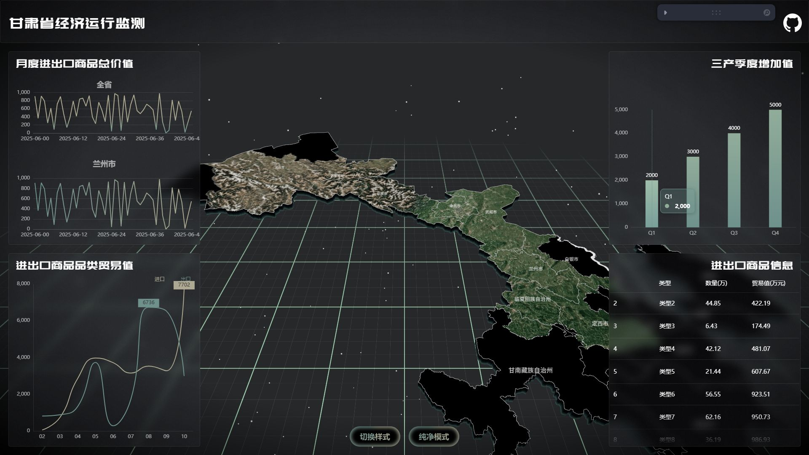
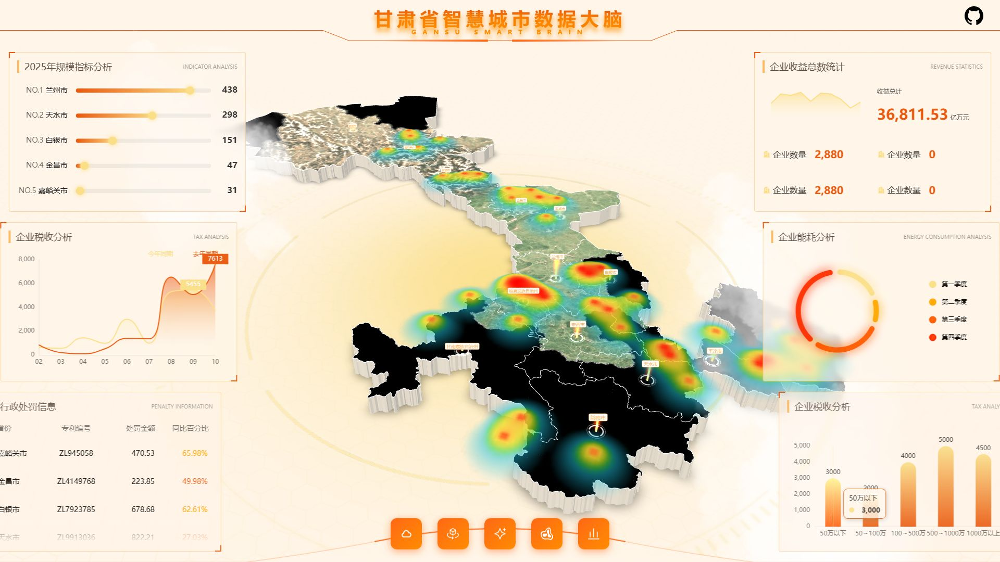
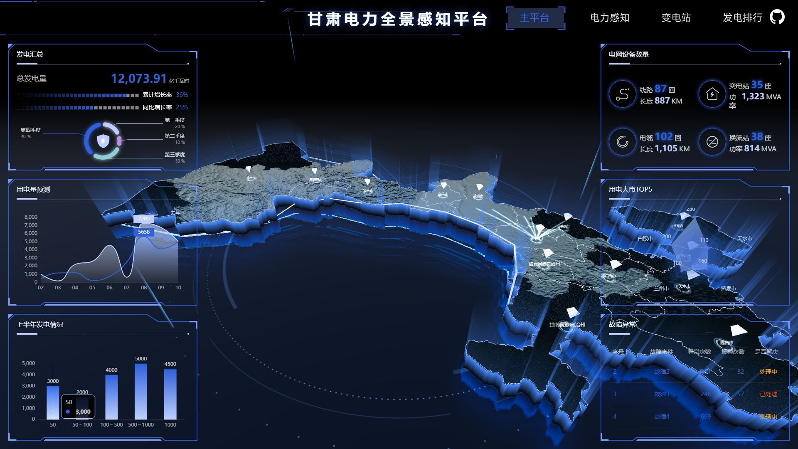

<div align="center">
  <h1>甘肃省数据可视化大屏</h1>
  <p>基于 Three.js + React 19 + ECharts 的 3D 地图可视化大屏项目</p>
  <p>包含 3D 地图渲染、轮廓飞线、侧边扫光、多图表联动等丰富功能</p>

<p>
    <a href="https://react.dev/">
      
    </a>
    <a href="https://threejs.org/">
      
    </a>
    <a href="https://www.typescriptlang.org/">
      
    </a>
  </p>
</div>

## 预览

| [Demo0 - 经济运行监测](https://andanlandian23.github.io/sc-datav/#/demo0) | [Demo1 - 智慧城市数据大脑](https://andanlandian23.github.io/sc-datav/#/demo1) |
| ------------------------------------------------------- | ------------------------------------------------------- |
|                            |                            |

| [Demo2 - 电力全景感知平台](https://andanlandian23.github.io/sc-datav/#/demo2) | [Demo3 - 风力发电机模型](https://andanlandian23.github.io/sc-datav/#/demo3) |
| ------------------------------------------------------- | ------------------------------------------------------- |
|                            |                            |

## 页面说明

### Demo0 — 经济运行监测（平面地图 + 飞线）

- 甘肃省 14 个地级市的 3D 平面地图，带卫星贴图和法线贴图
- 沿省界轮廓流动的飞线动画，使用自定义着色器实现彗星尾效果
- 省界侧面的竖向扫描光带动画
- 支持切换纹理/位移贴图两种地图风格，支持纯净模式

### Demo1 — 甘肃省智慧城市数据大脑（立体地图 + 柱状图）

- 各城市区域拉伸为 3D 立体块，带 GSAP 入场动画
- 从各城市中心升起的发光柱体，带底部旋转光环和侧面辉光
- 热力图叠加、云层效果、底部扫描波纹动画
- 6 个数据图表面板 + 底部虚拟滚动实时数据表

### Demo2 — 甘肃电力全景感知平台（暗黑科幻风）

- 城市区域可交互悬停，自定义扫描着色器（ShiftMaterial）
- 光束灯、轨迹飞线、边界光晕、镜面反射等科幻效果
- 用电大市 TOP5 雷达图（嘉峪关、白银、兰州、酒泉、天水）

### Demo3 — 风力发电机 3D 模型

- 风力发电机 GLB 模型展示，带 Bloom 后处理发光效果
- HDR 环境贴图、自动旋转、拆解/还原交互

## 功能特性

1. **3D 地图可视化**: 基于 Three.js 的 3D 地图渲染，轮廓飞线动画效果，侧边扫光视觉效果
2. **甘肃省地图展示**: 甘肃省 14 个地级市/自治州地理轮廓精确呈现
3. **多图表联动**: 柱状图、折线图、雷达图等多种数据可视化形式
4. **响应式设计**: 使用 autofit.js 支持多种屏幕尺寸自适应
5. **实时调试面板**: 使用 Leva 实现参数实时调整

## 技术栈

- **核心框架**: React 19 + TypeScript
- **构建工具**: Vite 8 (Rolldown 版本)
- **3D 可视化**: Three.js + @react-three/fiber + @react-three/drei
- **数据可视化**: ECharts 6
- **地理数据处理**: D3-geo + TopoJSON
- **动画库**: GSAP
- **样式库**: Styled-components
- **调试工具**: Leva
- **自适应布局**: autofit.js
- **状态管理**: Zustand

## 目录结构

```
src/
├── assets/                     # 静态资源文件
│   ├── gs.json                 # 甘肃省 14 个地级市 GeoJSON 数据
│   ├── gs_outline.json         # 甘肃省省级轮廓 GeoJSON
│   ├── heatmapData.json        # 热力图数据
│   ├── sc_map.png              # 卫星贴图
│   ├── sc_normal_map.png       # 法线贴图
│   └── ...                     # 其他纹理资源
├── components/                 # 通用组件
│   ├── autoFit.tsx             # 自适应布局组件
│   ├── chart.tsx               # ECharts 图表组件
│   ├── numberAnimation.tsx     # 数字动画组件
│   └── seamVirtualScroll.tsx   # 虚拟滚动组件
├── hooks/                      # 自定义 Hooks
│   ├── useAnimationFrame.ts    # 动画帧 Hook
│   ├── useMoveTo.ts            # GSAP 滑入动画 Hook
│   └── useSize.ts              # 尺寸监听 Hook
├── pages/
│   ├── Index/                  # 首页（3D 轮播）
│   ├── Demo0/                  # 经济运行监测（平面地图 + 飞线）
│   │   ├── map/                # 地图相关组件
│   │   │   ├── index.tsx       # 地图入口
│   │   │   ├── baseMap.tsx     # 基础地图
│   │   │   ├── outline.tsx     # 轮廓扫光
│   │   │   └── flyLine.tsx     # 飞线动画
│   │   └── panel/              # 面板组件
│   │       ├── index.tsx       # 面板布局
│   │       └── chart1-4.tsx    # 图表组件
│   ├── Demo1/                  # 智慧城市数据大脑（立体地图）
│   │   ├── map/                # 地图相关组件
│   │   ├── panel/              # 面板组件
│   │   └── cityData.ts         # 城市统计数据
│   ├── Demo2/                  # 电力全景感知平台（科幻风）
│   │   ├── map/                # 地图相关组件
│   │   └── panel/              # 面板组件
│   └── Demo3/                  # 风力发电机 3D 模型
├── types/                      # TypeScript 类型定义
│   └── map.d.ts                # GeoJSON 类型
├── App.tsx                     # 路由配置
├── main.tsx                    # 应用入口
└── index.css                   # 全局样式
```

## 甘肃省行政区划

本项目包含甘肃省 14 个地级市/自治州：

| 序号 | 名称 | adcode |
|------|------|--------|
| 1 | 兰州市 | 620100 |
| 2 | 嘉峪关市 | 620200 |
| 3 | 金昌市 | 620300 |
| 4 | 白银市 | 620400 |
| 5 | 天水市 | 620500 |
| 6 | 武威市 | 620600 |
| 7 | 张掖市 | 620700 |
| 8 | 平凉市 | 620800 |
| 9 | 酒泉市 | 620900 |
| 10 | 庆阳市 | 621000 |
| 11 | 定西市 | 621100 |
| 12 | 陇南市 | 621200 |
| 13 | 临夏回族自治州 | 622900 |
| 14 | 甘南藏族自治州 | 623000 |

## 开发指南

### 环境要求

- Node.js >= 18

### 安装依赖

```bash
npm install
```

### 开发运行

```bash
npm run dev
```

### 构建部署

```bash
# 构建生产版本
npm run build

# 预览构建结果
npm run preview
```

## 数据来源

- 地理数据：[阿里云 DataV.GeoAtlas](https://datav.aliyun.com/portal/school/atlas/area_selector)
- 卫星贴图：可通过 [sat-hunter](https://github.com/knight-L/sat-hunter) 工具下载

## 致谢

基于 [knight-L/sc-datav](https://github.com/knight-L/sc-datav) 项目改造，特此感谢原作者。
